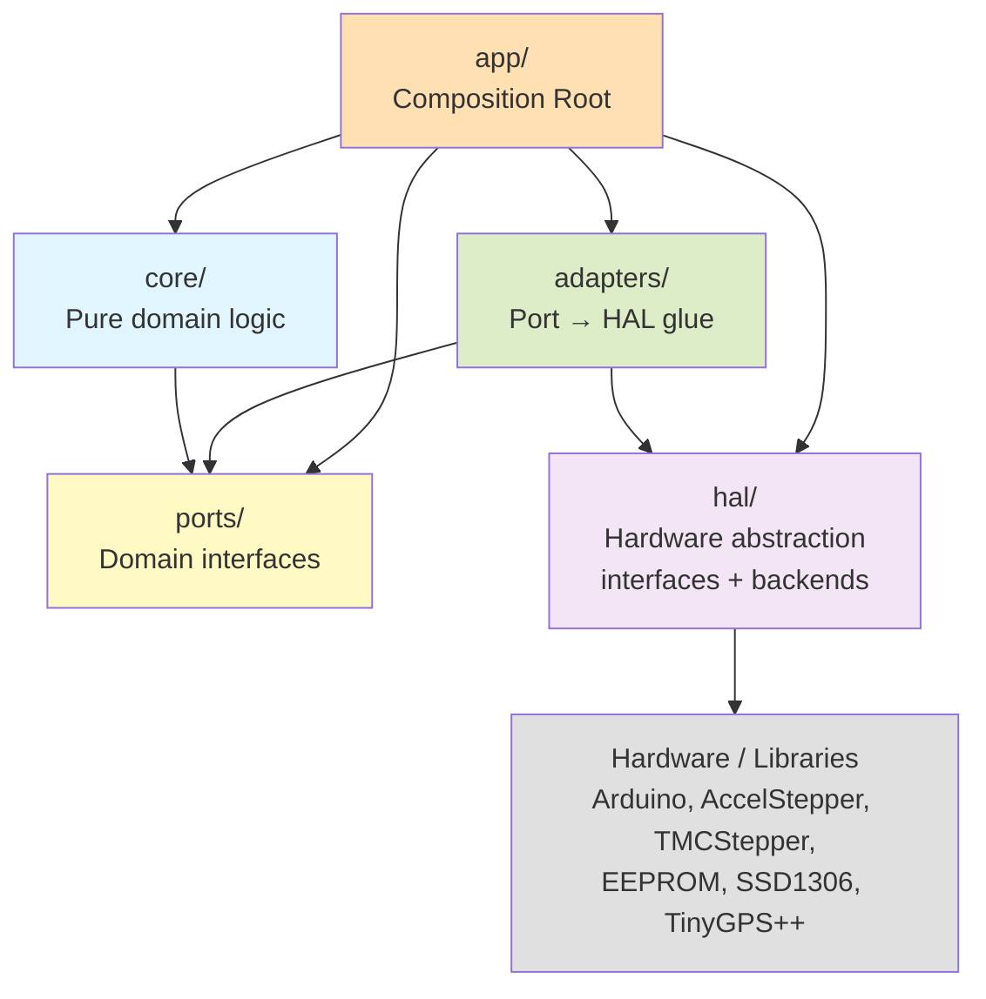

# Plan: Clean-Architecture Refactor of OpenAstroTracker-Firmware

## TL;DR
Refactor a ~5k-line `Mount` god-object firmware toward clean architecture for embedded:
a pure **Domain Core** (no Arduino, fully unit-testable) sitting behind **Port interfaces**,
with **Adapters** wrapping hardware (AccelStepper, TMC2209, EEPROM, displays, Wi-Fi, clock).
Approach: **hybrid** — extract pure logic into `core/` first, then test (invert the typical "test-first" order because `src/` root files transitively include `<Arduino.h>` via `inc/Globals.hpp` and are untestable in the `native` PIO env), then **strangler-fig** the hardware-coupled pieces (drivers, slewing loop, command executor) behind ports. Compile-time `#ifdef` axes/drivers migrate to **runtime polymorphism** so unsupported combinations no longer change the call graph. Goal endpoint: `src/core/` is buildable & 100% unit-tested on host; `src/adapters/` contains all Arduino/library coupling; `src/app/` wires them up per board.

---

## Architecture

### Goals

| # | Goal | Rationale |
|---|------|-----------|
| 1 | **Make domain logic host-testable** | The `native` PIO env can't compile `src/` root files (they transitively include `<Arduino.h>` via `inc/Globals.hpp`). Pure logic must live in `src/core/` with zero Arduino deps so tests run in milliseconds, not on hardware. |
| 2 | **Shrink the `Mount` god-object** | `Mount.cpp` is ~5000 LOC holding all domain behavior. End state: `Mount` is a thin facade (≤ 500 LOC) over focused controllers in `core/`. |
| 3 | **Eliminate `#ifdef` from domain code** | Feature flags for axes, driver types, and sensors currently produce 2^N untested build combinations. These become runtime polymorphism behind interfaces — the composition root makes one choice; `core/` never branches. |
| 4 | **Swap hardware without touching logic** | Changing stepper library, display type, or EEPROM backend must not require edits to `core/` or `ports/`. |
| 5 | **Coverage that means something** | Target: `core/` ≥ 85% line coverage with tests that verify behavior (not tautologies). |

### Requirements & Constraints

| Category | Constraint | Why |
|----------|-----------|-----|
| **Hardware** | Must build & run on all 5 boards (AVR_MEGA2560, MKS_GEN_L_V1/V2/V21, ESP32_ESP32DEV) | Existing user base; CI matrix enforces this. |
| **Memory** | AVR_MEGA2560 has 256 KB flash, 8 KB SRAM | Flash overflow is caught at link time. Mitigation: keep vtable count ≤ ~12, mark adapters `final`, consider template-based static dispatch as escape hatch. |
| **C++ standard** | C++17 for `core/` (needs `etl::optional`, `if constexpr`); boards may require C++14 fallback with ETL polyfills | `native` env already uses `-std=gnu++17`. Board envs will be audited per phase. |
| **Testability** | `core/` must never include `<Arduino.h>` or use `String`, `Serial`, `millis()`, `LOG()` | Enforced by CI grep check. `native` env only compiles `core/`, `ports/`, `adapters/`. |
| **Back-compat** | Meade LX200 serial protocol behavior is invariant | External interfaces (Stellarium, ASCOM) must not break. Internal C++ APIs may change freely. |
| **Shippable increments** | Every phase/step must be independently shippable — all boards green, all tests green | No flag days; thin overlays preserve old call-sites during transition. |
| **Tooling** | PlatformIO + Googletest + FakeIt (bundled with ArduinoFake) + gcovr | Already configured in `platformio.ini` and CI (`ci.yml`). |

### Layers & Dependencies

Dependencies point inward only. No layer may reference a layer above it.



| Layer | Directory | Depends on | Contains | Test strategy |
|-------|-----------|------------|----------|---------------|
| **core/** | `src/core/` | `ports/` only | Domain controllers (`SlewController`, `TrackingController`, …), algorithms (`SiderealClock`, `CoordinateMath`, …), `MeadeParser`, `MountState`, `EventBus`, `MountConfig` | Pure unit tests with FakeIt-faked ports. No hardware, no Arduino. `native` env. |
| **ports/** | `src/ports/` | nothing | Domain interfaces: `IClock`, `ILogger`, `IPersistentStore`, `IStepperAxis`, `IMotorDriver`, `IDisplay`, `IHomingSensor`, `IEndSwitch`, `IGps`, `ITransport` | Pure abstract interfaces — no implementation to test. |
| **adapters/** | `src/adapters/` | `ports/` + `hal/` | Thin glue: `AccelStepperAxis`, `EepromPersistentStore`, `SerialLogger`, `Tmc2209Driver`, `HallHomingSensor`, `SerialTransport`, `WifiTransport`, `MeadeCommandAdapter` | Integration tests: adapter → faked HAL port. |
| **hal/** | `src/hal/` | hardware libraries only | Interfaces (`IGpioPin`, `ISerialPort`, `IStepperMotor`, `ITmcDriver`, `ISystemClock`, `ITimerService`, …) + per-platform backends (`hal/arduino/`, `hal/avr/`, `hal/esp32/`) | Not host-tested (wraps hardware). Verified by on-device smoke tests. |
| **app/** | `src/app/` | all layers | Composition root. Board-specific configuration comes from a header (e.g. `Configuration_local_oaeboardv1.hpp`, selected by the PIO environment) which populates a runtime `MountConfig` struct. Wires up the object graph. Replaces the legacy `.ino` entry point. | Verified by on-device smoke tests across all 5 boards. |

**Why both `hal/` and `ports/`:**
- `hal/` describes *what the hardware can do* (pin toggles, UART bytes, timer ticks). One backend per platform.
- `ports/` describes *what the domain needs* (axis position, persistent value, "now"). Adapters compose one or more HAL services to satisfy a port — e.g. `AccelStepperAxis` implements `IStepperAxis` using `IStepperMotor` + `ITimerService` from HAL.
- This split means a new stepper library requires a new HAL backend, not a port change. A new domain requirement (e.g. "axis acceleration profile") requires a port change, not a HAL change.

### Cross-cutting rules

| Rule | Enforcement |
|------|-------------|
| `core/` never includes `<Arduino.h>`, `String`, `Serial`, `millis()`, `LOG()`, or any board pin header | CI grep check (Phase 4+) |
| `core/` and `ports/` contain zero `#ifdef` for feature flags | CI grep check (Phase 4+) |
| Time = `IClock` port (backed by `hal::ISystemClock`); no direct `millis()` | Interface contract |
| Logging = `ILogger` port (backed by `hal::ISerialPort`); no direct `Serial.print()` | Interface contract |
| Configuration = runtime `MountConfig` struct populated once in `app/` from `Configuration*.hpp` macros | Single translation unit reads macros |
| Optional axes (AZ, ALT, Focus) = `etl::optional` or null-object pattern; no `#ifdef` branches | Composition root constructs or injects null |
| ISR-safety: `IStepperAxis::Snapshot()` returns an ISR-safe state snapshot; mutation methods are main-loop-only | Settled in Phase 2 before Phase 3 controller extraction |
| `Mount` becomes a thin facade (≤ 500 LOC) over `core/` controllers, retained for Meade back-compat, gradually deprecated | Shrinks each phase as controllers are extracted |

---

## Current State (after Meade parser migration)

### ✅ Completed: Meade parser migrated to `core/`

The Meade LX200 command parser has been fully extracted into `src/core/meade/` as a pure, host-testable, allocation-light parser with no side effects. The split is:

| Layer | Location | Status |
|-------|----------|--------|
| **Parser** (pure) | `src/core/meade/MeadeParser.*` + 11 family-specific `.cpp` files | ✅ Done — 100% covered by 13 test files in `unit_tests/test_core/meade/` |
| **Protocol spec** | `src/core/meade/MeadeProtocol.hpp` | ✅ Done — comprehensive protocol documentation |
| **Handler interfaces** | `src/core/meade/MeadeParser.hpp` (12 `IMeade*Handlers` interfaces + aggregate `IMeadeHandlers`) | ✅ Done — clean typed contracts |
| **Executor/Adapter** | `src/MeadeCommandProcessor.hpp/cpp` | ✅ Done — implements `IMeadeHandlers`, delegates to `Mount`/`LcdMenu` |

The parser directory (`src/core/meade/`) contains 16 files covering all 12 command families (Get, Set, Quit, Distance, Init, SyncControl, Home, SlewRate, GPS, Focus, Movement, Extra). Each family has:
- A typed handler interface (e.g. `IMeadeGetHandlers`, `IMeadeMovementHandlers`)
- A `handleMeade*` entry point that parses suffixes, invokes handler callbacks, and serializes `MeadeResponse`
- Value types for coordinates (e.g. `RaCoordinate`, `DecCoordinate`)

The `MeadeCommandProcessor` adapter bridges the parser to the legacy `Mount` singleton, implementing all ~90 handler overrides. It is the **only** file in `src/` root that references the core parser.

### Test coverage

13 test files in `unit_tests/test_core/meade/` provide comprehensive wire-byte coverage for every parser family using fake handler stubs. Tests verify:
- Exact wire-byte formatting (zero-padding, sign rules, terminators)
- Suffix classification and handler dispatch routing
- Edge cases (malformed input, overflow, unknown sub-commands)
- Parser-level validation (the `parseMeadeCommand` classifier)

### What remains

The parser is pure and tested. The executor (`MeadeCommandProcessor`) is an adapter that still couples to `Mount*` and `LcdMenu*` directly. The `Mount` god-object still contains all domain logic (slewing, tracking, guiding, parking, homing, focus, coordinate math). No HAL, ports, or controllers exist yet beyond the meade parser.

---

## Phased Plan (each phase shippable & green in CI)

### Phase 0 — Safety net & tooling (no behavior change) ✅ COMPLETE
*Foundation for everything else; must land first. Already implemented — see audit below.*

1. ~~Add FFF as header-only dep~~ — **Superseded.** FakeIt (bundled with ArduinoFake) replaces FFF. No separate FFF needed.
2. ~~Add `native_core` PIO env~~ — **Superseded.** Only the `native` env is used. The existing `native` env already has strict warnings (`-Wall -Wextra -Werror -Wpedantic -Wshadow`).
3. ✅ gcovr-based **coverage reporting** in `native` env — **Done.** `scripts/test-coverage.py` + `--coverage` flag in `build_src_flags`. `pio run -e native -t coverage` produces HTML + markdown reports. Current: 88.3% lines, 97.0% functions, 76.5% branches.
4. ✅ CI workflow — **Done.** `.github/workflows/ci.yml` runs `pio run -e native -t coverage` (which internally executes `pio test -e native -vvv`), publishes coverage markdown to step summary. Threshold gating deferred to a later phase.
5. ✅ **ArduinoFake** as `test_lib_deps` — **Done.** Configured in `platformio.ini` `[env:native]` as `ArduinoFake@^0.4.0`. Provides stubbing/verification via FakeIt-based API for Arduino API mocking (`millis`, `String`, `pinMode`, `digitalWrite`, fake `EEPROM`, fake `Serial`, fake `Wire`, fake `SPI`).
6. ✅ Folder structure — **Done.** `src/ports/`, `src/hal/`, `src/adapters/`, `src/app/` all exist with descriptive README files.

**Verify:** `pio test -e native -v` → 170 tests, 0 failures; coverage report generates; all 5 board matrix builds green via `matrix_build.py`.

**Changes from original plan (per feedback):** FFF replaced by FakeIt (in ArduinoFake); `native_core` env eliminated (use `native` only); coverage threshold gating deferred to a later phase.

### Phase 1 — Extract pure domain logic into `core/`, then test
*The original plan called for testing before extraction. That doesn't work here: every `src/` root file includes `inc/Globals.hpp` → `<Arduino.h>`, and uses `String`/`LOG()`/Arduino APIs. The `native` PIO env only builds `core/`, `ports/`, `adapters/` — not `src/` root files. **New approach: extract pure subsets into `core/` first, then write exhaustive tests.** Each step is independently shippable. No behavior change.*

**Structure:** Data containers (`DayTime`, `Declination`, `Latitude`, `Longitude`) go under `src/core/types/`. Algorithm modules (`SiderealClock`, `CoordinateMath`, `CalendarMath`, `CoordinateFormatter`) live at `src/core/` root. EEPROM layout constants (`EepromLayout`) live in `src/hal/` — they describe a storage format, not domain behavior.

```
src/core/
├── meade/                     # ✅ already extracted — parser + protocol
├── types/                     # NEW — pure data containers
│   ├── DayTime.hpp/.cpp
│   ├── Declination.hpp/.cpp
│   ├── Latitude.hpp/.cpp
│   └── Longitude.hpp/.cpp
├── SiderealClock.hpp/.cpp     # algorithm producing DayTime outputs
├── CoordinateMath.hpp/.cpp    # algorithm consuming coordinate types
├── CalendarMath.hpp/.cpp      # pure date arithmetic
├── CoordinateFormatter.hpp/.cpp  # char-buffer formatting
```

The `src/` originals become **thin overlays**: they `#include` the `core/` version and add only Arduino-dependent methods (`ParseFromMeade`, `ToString`, `formatString`). This preserves back-compat — no flag day.

#### Step 1: DayTime — extract pure arithmetic subset
*Parallel with Steps 5, 7.*

**What's pure** (uses only `long` math, no Arduino types): constructors, `getHours/getMinutes/getSeconds/getTotalHours/getTotalMinutes/getTotalSeconds`, `set`, `addHours/addMinutes/addSeconds`, `addTime/subtractTime`, `sign`, `checkHours`.

**What stays** (uses Arduino `String` or `LOG()`): `ParseFromMeade`, `ToString`, `formatString`.

**Plan:**
1. Create `src/core/types/DayTime.hpp/.cpp` — pure header with arithmetic only.
2. Keep original `src/DayTime.hpp/cpp` as overlay: `#include "core/types/DayTime.hpp"` + Arduino-dependent methods.
3. Write `unit_tests/test_core/test_daytime.cpp` — construction, 24h wrap, negative hours, add/subtract across midnight.

#### Step 2: Declination, Latitude, Longitude — extract pure subsets
*Depends on Step 1.*

All three inherit `DayTime`. Pure parts: `checkHours()` clamping, degree conversion, constructors. What stays: `ParseFromMeade(String const&)`, `ToString()`, `formatString()`.

**Plan:**
1. Create `src/core/types/Declination.hpp/.cpp`, `Latitude.hpp/.cpp`, `Longitude.hpp/.cpp` — each inherits `core::DayTime`.
2. Old `src/Declination.hpp` becomes: `#include "core/types/Declination.hpp"` + `ParseFromMeade`/`ToString`/`formatString` overlay.
3. Write `test_declination.cpp`, `test_latitude.cpp`, `test_longitude.cpp` — clamping edges, hemisphere handling.

#### Step 3: Sidereal — extract pure math, leave GPS behind
*Depends on Step 1.*

`Sidereal.cpp` is 130 lines. The GPS path (`calculateByGPS`) uses TinyGPS++. The pure math (`calculateByDateAndTime`, `calculateHa`, `calculateTheta`, `calculateDeltaJd`) uses only `double` + `DayTime`.

**Plan:**
1. Create `src/core/SiderealClock.hpp/.cpp` — `calculateByDateAndTime` and `calculateHa`.
2. Keep old `src/Sidereal.cpp` with `calculateByGPS` + thin wrappers delegating to `core::SiderealClock`.
3. Create `test_core/test_sidereal.cpp` — LST/HA from known dates (equinoxes, solstices), leap years.

#### Step 4: Mount — extract `calculateRAandDECSteppers` math
*Depends on Steps 1-2.*

The ~200-line function computes stepper positions from RA/DEC targets. Core math is pure arithmetic on floats/longs (hemisphere, meridian flip, 3-solution selection).

**Plan:**
1. Create `src/core/CoordinateMath.hpp/.cpp` with plain structs (`MountGeometry`, `EquatorialTarget`, `StepperSolution`) and free function `calculateStepperPositions()`.
2. `Mount::calculateRAandDECSteppers` becomes a thin wrapper that fills `MountGeometry` from member fields, calls the free function.
3. Write `test_core/test_coordinate_math.cpp` — parametrized over hemisphere, meridian-flip boundary, pole targets.

#### Step 5: Mount — extract calendar math
*Parallel with Steps 1, 7.*

`Mount::getLocalDate()` handles year/month/day increment with month-length tables and leap-year logic. Pure integer math.

**Plan:**
1. Create `src/core/CalendarMath.hpp/.cpp` with `struct CalendarDate` and `addDays()`.
2. `Mount::getLocalDate()` delegates to this.
3. Write `test_core/test_calendar.cpp` — month boundaries, leap years incl. century rules.

#### Step 6: Mount — extract coordinate formatting
*Depends on Steps 1-2.*

`Mount::RAString()` and `Mount::DECString()` format RA as HH:MM:SS# and DEC as sDD*MM:SS#. Pure char-buffer manipulation.

**Plan:**
1. Create `src/core/CoordinateFormatter.hpp/.cpp` with `formatRA(char*, const DayTime&)` and `formatDEC(char*, const Declination&)`.
2. Old `RAString`/`DECString` allocate `String` and call the formatter.
3. Write `test_core/test_coordinate_format.cpp` — exact wire-byte output, sign rules, zero-padding.

#### Step 7: EPROMStore — extract validation logic
*Parallel with Steps 1, 5.*

`EPROMStore` uses Arduino EEPROM API directly. Data-validation logic (magic markers `0xCE`/`0xCF`, struct layouts) is separable.

**Plan:**
1. Create `src/hal/EepromLayout.hpp` — struct definitions and validation constants (no Arduino deps; EEPROM layout is a storage format, not domain logic).
2. Full `IPersistentStore` port + adapter comes in Phase 2.

**Verify:** `pio test -e native -v` — all new tests pass; `pio run -e <board>` for all 5 boards builds green per step; `scripts/test-coverage.sh` shows ≥ 85% line coverage on new `core/` files; manual: mount slews to known coordinates on real hardware.

### Phase 2 — Introduce HAL, Ports & Adapters
*Define the HAL surface, define the domain ports, and route current call sites through them. Keep current behavior bit-for-bit.*

1. Define **HAL interfaces** in `src/hal/`:
   - `IGpioPin`, `ISerialPort`, `ISpiBus`, `II2cBus`, `IEeprom`,
   - `IStepperMotor` (step/dir pulses, microstep config), `ITmcDriver` (UART register IO),
   - `IOledPanel`, `ICharLcd`, `IButtonMatrix`,
   - `ITimerService` (periodic/one-shot callbacks, used by interrupt stepper), `ISystemClock` (`millis`/`micros`),
   - `IWifiStack`.
2. Implement HAL backends:
   - `hal/arduino/` — generic Arduino implementation (`ArduinoGpioPin`, `ArduinoSerialPort`, `ArduinoEeprom`, `ArduinoSystemClock`, …).
   - `hal/avr/` — AVR-specific bits (Timer1/Timer3 interrupt service, fast pin IO).
   - `hal/esp32/` — ESP32-specific (hardware timers, Wi-Fi stack glue).
   - `unit_tests/test_common/hal_fakes/` — pure C++ test fakes (in-memory EEPROM, virtual GPIO, controllable clock, fake serial). Lives in test code, **not** in `src/`. Complements ArduinoFake (ArduinoFake handles the Arduino API layer; hal_fakes handles custom HAL interfaces).
3. Define domain **ports** in `src/ports/`:
   - `IClock`, `ILogger`, `IPersistentStore`,
   - `IStepperAxis` (position, target, speed, accel, run, stop, isRunning, `Snapshot()` for ISR safety),
   - `IMotorDriver` (enable/disable, microsteps, current; null implementation for non-TMC),
   - `IHomingSensor`, `IEndSwitch`, `IDisplay`, `IInfoDisplay`, `ITransport`, `IGps`.
4. Provide **adapters** in `src/adapters/` that bind ports to HAL:
   - `ArduinoClock` (port `IClock` ← hal `ISystemClock`), `SerialLogger`, `EepromPersistentStore`,
   - `AccelStepperAxis`, `InterruptAccelStepperAxis` (use `hal::ITimerService` + `hal::IStepperMotor`),
   - `Tmc2209Driver` (UART + standalone variants over `hal::ISerialPort`), `NullMotorDriver`,
   - `HallHomingSensor`, `GpioEndSwitch` (over `hal::IGpioPin`),
   - `LcdMenuDisplay`, `Ssd1306InfoDisplay` (over `hal::IOledPanel` / `hal::ICharLcd`),
   - `SerialTransport`, `WifiTransport` (over `hal::ISerialPort` / `hal::IWifiStack`),
   - `TinyGpsAdapter`.
5. Refactor `Mount` to **hold port pointers** (`IStepperAxis* _ra; IClock* _clock; ...`) injected at construction instead of owning concrete types. Composition happens in `app/` (currently `b_setup.hpp`). **Migration note:** `Mount` is currently accessed as a global (`extern Mount mount;` from `a_inits.hpp`). Call sites that use `mount.xxx()` will be updated to receive a pointer/reference. This uses the same thin-overlay pattern as Phase 1 — existing call sites delegate through the global during transition, then migrate to injected references when their owning module becomes an adapter.
6. Replace direct `millis()`, `digitalWrite()`, `EEPROMStore::` calls inside `Mount` with port calls; replace `LOG()` macro with `_logger->log(...)`.
7. **ISR contract for `IStepperAxis`:** This phase MUST settle the threading model. `Mount::interruptLoop()` is called from ISR context (AVR Timer ISR / ESP32 FreeRTOS task). The `IStepperAxis` interface must specify which methods are ISR-safe and which are main-loop-only. `Snapshot()` provides an ISR-safe state read. This contract is a prerequisite for Phase 3's `SlewController`.

**Verify:** All Phase 1 tests still green; firmware builds all 5 boards (toolchain enforces flash limits).

### Phase 3 — Decompose `Mount` into controllers
*Strangler-fig: move responsibilities out of `Mount` into `core/` controllers, one at a time. Mount becomes a facade.*

**Prerequisite:** Phase 2's ISR contract for `IStepperAxis` must be settled. The threading model for `SlewController::update()` (main loop vs ISR context) follows from that contract.

Recommended slice order (each is an independent step, parallelizable after Phase 2):
1. `core/TrackingController` — tracking speed, sidereal rate, tracker-stop compensation. Owns `IStepperAxis* trk`.
2. `core/SlewController` — slew state machine extracted from the 280-line `Mount::loop`. Inputs are target + geometry; outputs are stepper commands and state events. **Threading model deferred to Phase 2's ISR contract.**
3. `core/GuidingController` — guide-pulse direction/speed math + timed completion (uses `IClock`).
4. `core/HomingController` — hall-sensor/end-switch state machine; owns `IHomingSensor* ra`, `IHomingSensor* dec`.
5. `core/ParkingController` — park position, parking transitions.
6. `core/FocusController` — focus motor (only constructed when focus axis is present; uses `etl::optional` in composition root).
7. `core/AzAltController` — AZ/ALT motors (only constructed when present; uses `etl::optional` in composition root).
8. `core/MountState` — single source of truth for the `_mountStatus` bitfield, with typed enum API (`Status::isSlewing()` etc.). Controllers mutate `MountState`; Mount facade reads it.
9. `core/EventBus` — controllers publish `PositionChanged`, `SlewStarted`, `Parked`, etc.; display adapter subscribes (removes Mount → display direct coupling).

Each step: extract → add focused unit tests with FakeIt-faked ports → remove the original code from `Mount.cpp` → ship.

**Verify per step:** unit tests for the new controller; all prior tests still green; firmware behavior on hardware unchanged (manual smoke checklist).

### Phase 4 — Compile-time flags → runtime polymorphism
*Eliminate `#ifdef` axes in `core/`, `ports/`, and most of `adapters/`. Feature flags survive only in the composition root and in HAL backend selection.*

1. Replace `AZ_STEPPER_TYPE`, `ALT_STEPPER_TYPE`, `FOCUS_STEPPER_TYPE` checks: composition root either constructs the controller and injects it, or injects a **null-object** controller. `core/` code calls unconditionally.
2. Replace `*_DRIVER_TYPE` checks with selection of the right `IMotorDriver` implementation at composition time (`Tmc2209Driver` vs `NullMotorDriver`).
3. `USE_HALL_SENSOR_*_AUTOHOME`, `USE_*_END_SWITCH` → presence of a non-null port implementation.
4. Truly board-specific code (interrupt registers, board pins) lives **only inside the relevant `hal/<platform>/` backend**; `core/`, `ports/`, and `adapters/` become `#ifdef`-free.
5. Add a `MountConfig` builder in `app/` that reads the `Configuration*.hpp` macros and produces a runtime config object.

**Verify:** `core/` and `ports/` contain zero `#ifdef` for features (CI grep check); all 5 existing board matrix builds still pass (toolchain enforces flash limits).

### Phase 5 — Meade execution layer cleanup
*The parser is already in `core/`. This phase finishes the Meade slice by refining the executor and transport layers.*

**Prerequisite:** Phase 3 must be substantially complete. The `MeadeCommandProcessor` currently holds a `Mount*` raw pointer and calls Mount methods directly. It can only be re-wired to port-based interfaces once Phase 3's controllers expose those ports.

1. `MeadeCommandProcessor` (current adapter) is already in `src/` root implementing `IMeadeHandlers` → move it to `src/adapters/MeadeCommandAdapter` to match layer conventions.
2. Introduce `adapters/SerialTransport` + `adapters/WifiTransport` to feed bytes to `core/meade/MeadeParser`; parsed commands dispatch to the adapter.
3. Remove `Mount* _mount` raw pointer from `MeadeCommandProcessor` — replace with port-based interfaces from Phase 2/3 (e.g. `IMeadeHandlers` implemented over controller interfaces, not the god-object).
4. Remove the legacy `Mount::delay()` blocking call from GPS acquisition handler — replace with `IClock`-based non-blocking state machine.
5. The existing 13 test files in `unit_tests/test_core/meade/` already cover all parser families. Add integration tests wiring `SerialTransport` → `MeadeParser` → `MeadeCommandAdapter` with faked ports.

**Verify:** Meade test suite green (existing 13 files + new integration tests); Stellarium/ASCOM round-trip smoke test (manual) recorded as a regression checklist; coverage of `core/meade/` ≥ 80% (already achieved).

### Phase 6 — Cleanup & documentation
1. Mount facade slimmed to a thin compat shim (or removed if no external dependents).
2. Move display-related code paths off the Mount → display direct call into the `EventBus`.
3. Architecture doc (`docs/architecture.md`) with the layer diagram, port catalog, and "where to add a new feature" guide.
4. Ratchet CI coverage gate to its final value (`core/` ≥ 85%).

**Verify:** Architecture doc reviewed; CI gates final; full board matrix green; smoke-tested on at least one real mount.

---

## Relevant files

### Already migrated to `core/`
- [`src/core/meade/`](src/core/meade/) — 16 files: parser, 12 family dispatchers, helpers, protocol spec, typed handler interfaces
- [`unit_tests/test_core/meade/`](unit_tests/test_core/meade/) — 13 test files covering all parser families with fake handler stubs

### Phase 1 targets — extract & test
- [`src/DayTime.cpp`](src/DayTime.cpp), [`src/DayTime.hpp`](src/DayTime.hpp) — extract pure arithmetic to `core/types/DayTime` (Step 1)
- [`src/Declination.cpp`](src/Declination.cpp), [`src/Latitude.cpp`](src/Latitude.cpp), [`src/Longitude.cpp`](src/Longitude.cpp) — extract pure subsets to `core/types/` (Step 2)
- [`src/Sidereal.cpp`](src/Sidereal.cpp) — extract pure math to `core/SiderealClock` (Step 3)
- [`src/Mount.cpp`](src/Mount.cpp) — extract `calculateRAandDECSteppers` to `core/CoordinateMath` (Step 4), `getLocalDate` to `core/CalendarMath` (Step 5), `RAString`/`DECString` to `core/CoordinateFormatter` (Step 6)
- [`src/EPROMStore.cpp`](src/EPROMStore.cpp) — extract validation logic to `hal/EepromLayout.hpp` (Step 7)

### New files created in Phase 1
- `src/core/types/DayTime.hpp`, `src/core/types/DayTime.cpp`
- `src/core/types/Declination.hpp`, `src/core/types/Declination.cpp`
- `src/core/types/Latitude.hpp`, `src/core/types/Latitude.cpp`
- `src/core/types/Longitude.hpp`, `src/core/types/Longitude.cpp`
- `src/core/SiderealClock.hpp`, `src/core/SiderealClock.cpp`
- `src/core/CoordinateMath.hpp`, `src/core/CoordinateMath.cpp`
- `src/core/CalendarMath.hpp`, `src/core/CalendarMath.cpp`
- `src/core/CoordinateFormatter.hpp`, `src/core/CoordinateFormatter.cpp`
- `src/hal/EepromLayout.hpp`
- `unit_tests/test_core/test_daytime.cpp`, `test_declination.cpp`, `test_latitude.cpp`, `test_longitude.cpp`
- `unit_tests/test_core/test_sidereal.cpp`, `test_coordinate_math.cpp`, `test_calendar.cpp`, `test_coordinate_format.cpp`

### Phase 2 targets
- [`src/HallSensorHoming.cpp`](src/HallSensorHoming.cpp), [`src/EndSwitches.cpp`](src/EndSwitches.cpp), [`src/Gyro.cpp`](src/Gyro.cpp), [`src/LcdMenu.cpp`](src/LcdMenu.cpp), [`src/SSD1306_128x64_Display.cpp`](src/SSD1306_128x64_Display.cpp), [`src/WifiControl.cpp`](src/WifiControl.cpp), [`src/LcdButtons.cpp`](src/LcdButtons.cpp) — become adapters behind ports.
- [`src/Core.cpp`](src/Core.cpp), [`src/a_inits.hpp`](src/a_inits.hpp), [`src/b_setup.hpp`](src/b_setup.hpp), [`src/f_serial.hpp`](src/f_serial.hpp) — wiring code gradually migrates into `src/app/`.

### Phase 5 targets
- [`src/MeadeCommandProcessor.cpp`](src/MeadeCommandProcessor.cpp), [`src/MeadeCommandProcessor.hpp`](src/MeadeCommandProcessor.hpp) — adapter already bridges parser to `Mount`; move to `src/adapters/` and wire through ports.
- [`src/f_serial.hpp`](src/f_serial.hpp) — serial framing code that calls `MeadeCommandProcessor::instance()->processCommand()`; becomes `SerialTransport` adapter.

### Infrastructure
- [`platformio.ini`](platformio.ini) — `native` env with coverage flags, ArduinoFake `test_lib_deps`, coverage extra script, `test_filter = test_core` (catches `test_core/meade/` too).
- [`.github/workflows/ci.yml`](.github/workflows/ci.yml) — runs `pio run -e native -t coverage` + publishes summary; builds all 5 boards.
- [`unit_tests/test_common/`](unit_tests/test_common/) — expand with FakeIt-based port fakes for Phase 2+.
- [`Configuration.hpp`](Configuration.hpp), [`Configuration_adv.hpp`](Configuration_adv.hpp) — read once by `MountConfig` builder in Phase 4.

---

## Verification strategy

Automated:
1. `pio test -e native -v` — full host test suite, runs every PR. Filter: `test_core` (covers `test_core/meade/` and new `test_core/` tests).
2. `pio run -e <board>` for the existing 5-board matrix — must remain green every phase.
3. Coverage gate via gcovr in CI — ratchets up phase by phase; `core/` final target ≥ 85%.
4. CI grep check: `core/` contains zero `#include <Arduino.h>` or `#ifdef <FEATURE_FLAG>` (after Phase 4).

Manual smoke checklist (per shippable phase end):
1. Mount slews to known coordinates within tolerance on real hardware (one volunteer-owned board).
2. Park / unpark cycle.
3. Guide pulses in all four directions produce expected micro-moves.
4. Stellarium/ASCOM LX200 round-trip (date, time, RA/DEC, sync) succeeds.
5. Hall-sensor auto-home succeeds (on a board so equipped).

---

## Decisions

- **Test stack:** **Googletest** + **FakeIt** (via ArduinoFake) for host-side unit tests. The `native` PIO env uses `test_framework = googletest`. FakeIt is bundled with ArduinoFake (`ArduinoFake@^0.4.0`) and provides the mocking/stubbing API (`When(Method(...)).Return(...)`, `Verify(Method(...))`). No Unity. No GoogleMock.
- **Migration style:** **Hybrid** — extract pure logic first (Phase 1), then strangler-fig hardware-coupled layers (Phase 2–5).
- **Config flags:** Migrate to **runtime polymorphism behind interfaces**; composition root reads the `Configuration*.hpp` macros once. `core/` becomes `#ifdef`-free for features.
- **Optional axes:** Use `etl::optional` (from Embedded Template Library) — not `std::optional`. The firmware builds with `-D ETL_NO_STL` on AVR targets. `core/` uses `etl::optional` for consistency across all build targets. The `native` test env adds ETL as a dependency.
- **Mount global migration:** `Mount` is currently a global variable (`extern Mount mount;` in `a_inits.hpp`). Call sites that use `mount.xxx()` will be migrated using the thin-overlay pattern: existing code delegates through the global during transition; when a module becomes a proper adapter (Phase 2+), it receives injected references instead. No flag day needed.
- **ISR threading model:** Deferred to Phase 2. The `IStepperAxis` interface contract (which methods are ISR-safe, `Snapshot()` semantics) will be settled before Phase 3 begins extracting controllers. Without this contract, `SlewController`'s threading model is undefined.
- **Back-compat:** Meade serial protocol behavior is invariant (external interface); internal C++ APIs may change freely.
- **Out of scope:** UI menu screens (`c*_menu*.hpp`) refactor; new features; supporting new boards; replacing AccelStepper/TMCStepper libraries; switching build system.
- **Extract-before-test:** All `src/` root files include `inc/Globals.hpp` → `<Arduino.h>` and are untestable in the `native` PIO env (which only builds `core/`, `ports/`, `adapters/`). Pure logic is extracted into `core/` first, then tested — inverted from the typical test-first order. Only already-pure code (`core/meade/`, `MappedDict`) gets tests before extraction.


## Further Considerations

1. **C++ standard.** `core/` benefits from at least C++17 (`etl::optional`, `if constexpr`). PlatformIO defaults vary by board (some AVR ports stuck on C++11/14). *Decision:* native env already uses `-std=gnu++17`. Each board env will be checked for C++17 support and upgraded if needed. Fallback: `-std=gnu++14` + ETL polyfills on boards that can't support C++17.
2. **Binary size on AVR_MEGA2560.** Polymorphism + extra indirection costs flash on AVR. The toolchain errors if flash is exceeded, so no explicit budget is needed. *Mitigation:* keep vtables small (≤ ~12 ports), mark adapters `final`, allow link-time devirtualization. If flash still overflows, accept template-based static dispatch for the hot path (`SlewController<RaAxis, DecAxis>`) — adds complexity but keeps AVR shipping.
3. **Characterization / golden-master tests.** A future task: capture known-good (RA,DEC → stepper position) pairs from real hardware for the `calculateRAandDECSteppers` math. This would serve as regression tests for the meridian-flip solution selector — the highest-risk coordinate math in the system. Not part of Phase 1; left as a follow-up task after extraction is complete and the pure math is independently testable on native.
4. **MeadeCommandProcessor singleton.** `MeadeCommandProcessor::instance()` is a true singleton (unlike `Mount`, which is a global). It's accessed from `f_serial.hpp`, `WifiControl.cpp`, `c_buttons.hpp`, and `testmenu.cpp`. Phase 5 moves it to `src/adapters/MeadeCommandAdapter`; the singleton pattern should be eliminated there in favor of a non-owning reference from the composition root.
